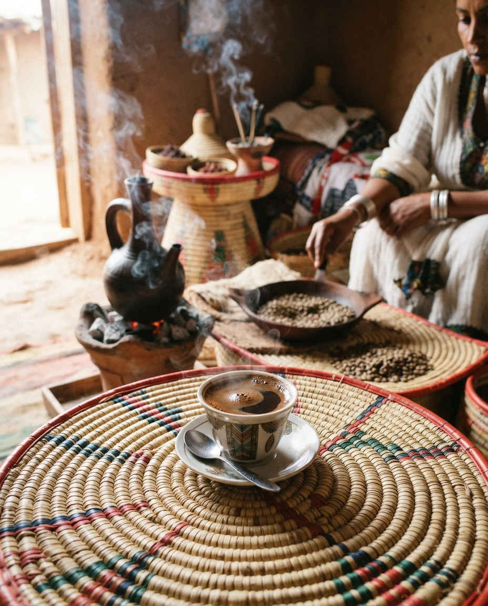
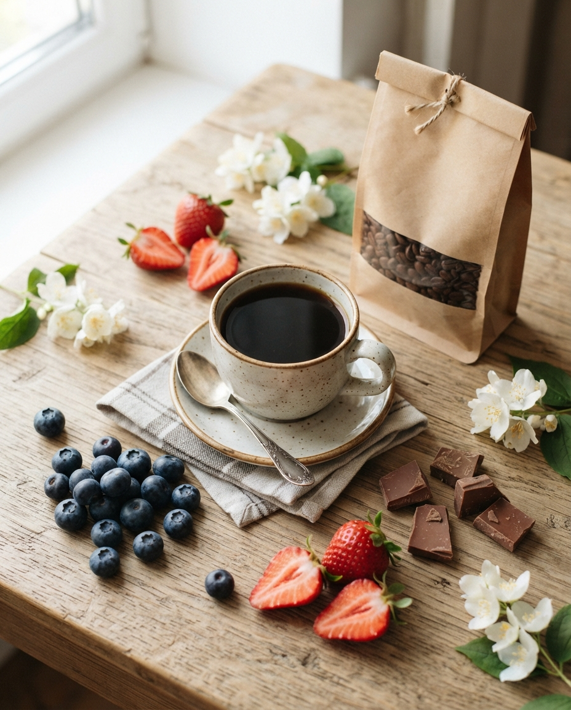
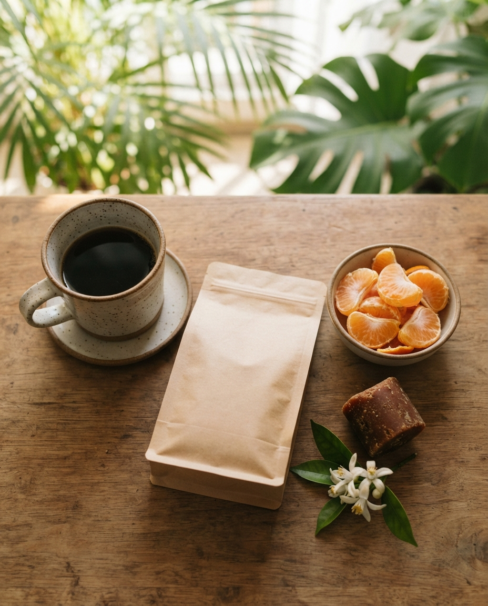
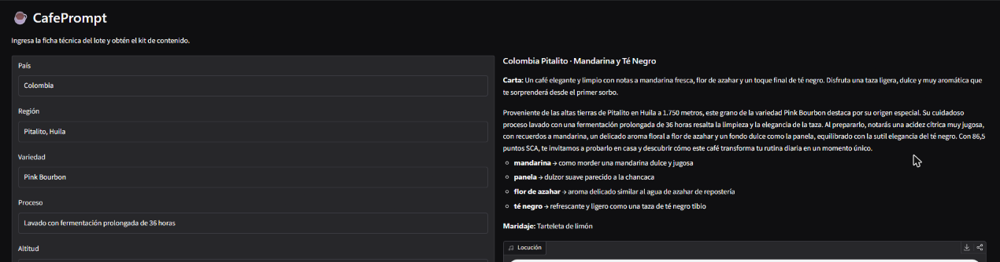

# ☕ CafePrompt: asistente de contenido con IA generativa para cafeterías de especialidad

**Proyecto Final — Curso "IA: Generación de Prompts" (Coderhouse)** · Autor: Sebastián Felipe Muñoz Rivera

Modelos utilizados: **texto-texto** (Google Gemini) · **texto-imagen** (Google AI Studio · Nano Banana 2 Lite) · *(extra)* **texto-audio** (gTTS) · *(extra)* **interfaz de usuario** (Gradio)

[](https://colab.research.google.com/github/sebakine/CafePrompt/blob/main/CafePrompt_POC.ipynb)

| Consigna | Dónde está |
|---|---|
| Título y resumen | [Título](#-cafeprompt-asistente-de-contenido-con-ia-generativa-para-cafeterías-de-especialidad) · [1. Resumen](#1-resumen) |
| Introducción (nombre, problema, propuesta, viabilidad) | [2. Introducción](#2-introducción) |
| Objetivos · Metodología · Herramientas | [3](#3-objetivos) · [4](#4-metodología) · [5](#5-herramientas-y-tecnologías) |
| Implementación (código, prompts e imágenes) | [6. Implementación](#6-implementación) · [`CafePrompt_POC.ipynb`](CafePrompt_POC.ipynb) · [`prompts/`](prompts/) · [`images/`](images/) |
| Resultados · Conclusiones · Referencias | [7](#7-resultados) · [8](#8-conclusiones) · [9](#9-referencias) |

---

## 1. Resumen

Las cafeterías y tostadurías de especialidad pequeñas venden un producto cuyo valor depende de información técnica (origen, variedad, proceso, altitud, notas de cata, puntaje SCA) que el cliente promedio no entiende, y rara vez cuentan con presupuesto para un redactor, un fotógrafo o un *community manager*. Cada vez que llega un nuevo lote hay que producir desde cero la descripción para la carta, las publicaciones para redes sociales y las imágenes que lo acompañan; en la práctica esto se hace tarde, de forma inconsistente o simplemente no se hace.

**CafePrompt** es una prueba de concepto que convierte la **ficha técnica de un lote de café** en un **kit de contenido listo para usar** mediante una cadena de prompts optimizados: (1) una descripción sensorial comprensible para el cliente, (2) tres variantes de *copy* para Instagram, (3) un prompt de imagen construido automáticamente por el modelo de texto y ejecutado en **Google AI Studio** con el modelo de imagen gratuito **Nano Banana 2 Lite** (texto-imagen), y (4) un guion locutado con **gTTS** (texto-audio). El texto se genera con la API gratuita de **Google Gemini**, aplicando *role prompting*, *few-shot*, salida estructurada en JSON, razonamiento guiado, encadenamiento de prompts y restricciones explícitas. La calidad se mide con controles automáticos y con una rúbrica de evaluación (*LLM-as-judge*) que compara un prompt ingenuo con el prompt optimizado. Todo el proyecto funciona con herramientas de costo cero.

## 2. Introducción

### 2.1 Nombre del proyecto
**CafePrompt** — asistente de contenido con IA generativa para cafeterías de especialidad.

### 2.2 Presentación del problema

**¿Cuál es el problema?** Una cafetería de especialidad rota lotes de café con frecuencia (microlotes que duran semanas). Por cada lote debe comunicar *por qué* ese café es distinto y vale más que un café comercial. La información disponible es la ficha del productor o importador, escrita en jerga técnica:

> *"Etiopía, Guji, Heirloom, natural, 2.000 msnm, 87 pts, arándano, frutilla, chocolate de leche."*

Para un cliente sin formación en cata, esta ficha no dice nada. Traducirla en un mensaje atractivo, fiel a los datos y consistente con la marca requiere tres habilidades que rara vez conviven en un equipo pequeño: **conocimiento sensorial**, **redacción publicitaria** y **producción visual**.

**¿Por qué es una problemática?**
- **Costo y tiempo:** contratar redacción, fotografía de producto y gestión de redes es inabordable para un negocio de 2 a 6 personas; el tiempo del barista se destina a la operación, no al marketing.
- **Brecha de comunicación:** si el cliente no entiende el valor del café, lo compara solo por precio y el negocio pierde su diferenciación.
- **Inconsistencia:** cada descripción la escribe una persona distinta, con otro tono, a veces con datos inventados ("notas a vainilla" que no están en la ficha) o con afirmaciones de salud que no corresponden.
- **Frecuencia:** el problema se repite con cada lote nuevo; no es una tarea única, sino un flujo recurrente que se beneficia de la automatización.

**¿Por qué es relevante resolverlo?** El café de especialidad compite por **experiencia e información**, no por volumen. Mejorar la comunicación de cada lote impacta directamente en la venta de granos y bebidas, en la educación del consumidor y en la trazabilidad hacia el productor. Una solución basada en prompts es replicable por cualquier cafetería sin conocimientos de programación.

### 2.3 Desarrollo de la propuesta de solución

La solución se vincula directamente con el uso de **modelos de IA generativa**: se usa un **modelo de lenguaje (texto-texto)** como "redactor catador" y un **modelo de difusión (texto-imagen)** como "fotógrafo de producto". El núcleo del proyecto es el **diseño y la optimización de prompts**, no el entrenamiento de modelos.

**Flujo (encadenamiento de prompts):**

```
Ficha técnica del lote (datos)
        │
        ▼
 P1  Texto-texto · Ficha sensorial para clientes (JSON)  ◄── few-shot + rol + restricciones
        │
        ├──► P2  Texto-texto · 3 variantes de copy para Instagram (JSON)
        │
        ├──► P3  Texto-texto · Meta-prompt → prompt de imagen optimizado (inglés)
        │            │
        │            ▼
        │        Texto-imagen · Google AI Studio (Nano Banana 2 Lite) genera la imagen
        │
        ├──► P4  Texto-texto · Guion para locución (≈30 s)
        │            │
        │            ▼
        │        Texto-audio · gTTS genera el MP3            (extra)
        │
        └──► P5  Texto-texto · Evaluación con rúbrica (LLM-as-judge) vs. P0 (prompt ingenuo)
```

**Prompts de cada etapa:**

| Etapa | Prompt | Modelo | Qué resuelve |
|---|---|---|---|
| Línea base | **P0** — prompt ingenuo de una línea | texto-texto | Sirve como punto de comparación para medir la mejora |
| 1 | **P1** — ficha sensorial para cliente | texto-texto | Traduce la jerga técnica a lenguaje de cliente, en JSON reutilizable |
| 2 | **P2** — *copy* para Instagram | texto-texto | Tres enfoques (origen, sensorial, educativo) listos para publicar |
| 3 | **P3** — meta-prompt de imagen | texto-texto → texto-imagen | El LLM escribe el prompt visual a partir de las notas de cata |
| 4 | **P4** — guion de locución | texto-texto → texto-audio | Audio para Reels o para accesibilidad de la carta |
| 5 | **P5** — rúbrica de evaluación | texto-texto | Mide fidelidad, claridad, tono y formato |

### 2.4 Justificación de la viabilidad del proyecto

| Recurso | Elección | Justificación |
|---|---|---|
| Modelo texto-texto | **Google Gemini API** (capa gratuita, modelo *Flash-Lite*) | Sin costo, sin tarjeta de crédito, buena calidad en español, soporta salida JSON nativa. El *pipeline* completo usa ~20 llamadas, muy por debajo de los límites diarios de la capa gratuita. |
| Modelo texto-imagen | **Google AI Studio** — modelo **Nano Banana 2 Lite** (`gemini-3.1-flash-lite-image`), uso gratuito desde la interfaz web | DALL·E dejó de ser gratuito. Se evaluó primero **NightCafe** (sugerida por el curso): el modo invitado permite solo una imagen y exige crear cuenta para continuar. AI Studio es gratuito con la misma cuenta de Google usada para la API de texto, permite fijar la relación de aspecto (4:5) y la resolución, y no agrega marcas de agua. Según la consigna, el prompt se escribe directamente en la herramienta (sin API) y la imagen se agrega al repositorio. |
| Texto-audio (extra) | **gTTS** | Librería gratuita, sin clave, voz en español latinoamericano. |
| Interfaz (extra) | **Gradio** | Crea una UI web en pocas líneas y funciona dentro de Colab. |
| Entorno | **Google Colab** + GitHub | Gratuito, sin instalación local, reproducible desde el botón *Open in Colab*. |

**Viabilidad técnica y de tiempo:** el alcance está acotado a una POC de 3 lotes de café, lo que se puede construir y probar en pocas jornadas de trabajo. No se entrena ningún modelo; el esfuerzo se concentra en ingeniería de prompts.

**Riesgos y mitigaciones:**
- *Límites de uso de la capa gratuita (error 429)* → reintentos con espera progresiva y lista de modelos de respaldo.
- *Cambios de disponibilidad de modelos* → el modelo es un parámetro; el cliente prueba varios candidatos.
- *Ausencia de clave de API al revisar el notebook* → **modo caché**: las respuestas reales obtenidas en la ejecución original se guardan en `outputs/cache_respuestas.json` y el notebook se ejecuta completo igualmente.
- *Alucinaciones (datos inventados)* → restricciones explícitas ("usa solo la ficha"), controles automáticos y rúbrica de fidelidad.
- *Texto ilegible en imágenes generadas* → el prompt de imagen prohíbe texto y logos; la marca se agrega después en diseño.
- *Herramientas de imagen que cambian sus condiciones* (NightCafe exige cuenta; DALL·E dejó de ser gratuito) → los prompts de imagen son texto portable: funcionan en cualquier generador y quedan documentados en `prompts/prompts_imagen.md`.

## 3. Objetivos

**Objetivo general**
Desarrollar una prueba de concepto que, a partir de la ficha técnica de un lote de café de especialidad, genere automáticamente un kit de comunicación (texto, imagen y audio) fiel a los datos, comprensible para el cliente y alineado a la marca, usando exclusivamente técnicas de *prompting* y herramientas gratuitas.

**Objetivos específicos**
1. **Identificar** la problemática de comunicación de valor en cafeterías de especialidad pequeñas y plantear una solución con IA generativa (texto-texto y texto-imagen).
2. **Diseñar** una cadena de prompts (P1 a P4) que transforme datos técnicos en: descripción para la carta, *copy* para Instagram, prompt de imagen y guion de audio.
3. **Generar** imágenes de producto con una herramienta gratuita (Google AI Studio · Nano Banana 2 Lite) a partir de prompts construidos por el modelo de texto.
4. **Optimizar** los prompts: comparar un prompt ingenuo (P0) contra el prompt optimizado (P1), y un prompt de imagen básico (v1) contra el optimizado (v2).
5. **Evaluar** los resultados con controles automáticos (formato, extensión, idioma) y una rúbrica cuantitativa (P5).
6. **Evaluar la disponibilidad de recursos:** operar con costo cero, midiendo tokens y número de llamadas.
7. *(Extra)* Integrar un tercer modelo (texto-audio) y una interfaz de usuario.

## 4. Metodología

El proyecto se desarrolla en **cinco fases**, siguiendo un ciclo iterativo *diseñar → probar → medir → ajustar* propio de la ingeniería de prompts:

| Fase | Procedimiento | Justificación |
|---|---|---|
| **1. Definición del problema y de los datos** | Se define una ficha técnica estándar (origen, región, variedad, proceso, altitud, notas, puntaje, tueste, método) y un perfil de marca (nombre, tono, público, restricciones). Se preparan 3 lotes contrastantes: Etiopía natural, Colombia lavado y Brasil *pulped natural*. | Datos estructurados reducen la ambigüedad del prompt y permiten verificar la fidelidad de la salida. Los tres lotes cubren perfiles sensoriales distintos (frutal, floral-cítrico, chocolatoso). |
| **2. Línea base** | Se ejecuta un prompt ingenuo (P0) sin rol, formato ni restricciones. | Sin línea base no es posible demostrar que la optimización mejora algo. |
| **3. Diseño de prompts optimizados** | Se construyen P1–P4 con la arquitectura **rol + contexto + tarea + formato de salida + restricciones**, y se encadenan (la salida JSON de P1 es entrada de P2, P3 y P4). | La estructura explícita y el JSON hacen la salida predecible y reutilizable; el encadenamiento divide un problema complejo en tareas simples. |
| **4. Generación multimodal** | El prompt de imagen producido por P3 se ejecuta manualmente en Google AI Studio (mismo modelo y configuración para todos, un chat nuevo por imagen); el guion de P4 se convierte en audio con gTTS. | Conecta el modelo de texto con el de imagen: el LLM "traduce" notas de cata a lenguaje visual, algo difícil de hacer a mano. |
| **5. Evaluación y ajuste** | (a) Controles automáticos: JSON válido, límites de palabras, cantidad de *hashtags*, ausencia de voseo y de afirmaciones de salud; (b) rúbrica P5 de 1 a 5 en cinco criterios, comparando P0 vs. P1; (c) comparación visual imagen v1 vs. v2; (d) registro de tokens y latencia. | Combinar métricas deterministas con evaluación por rúbrica da una medida objetiva y otra cualitativa de la calidad. |

**Parámetros de generación:** temperatura baja (0,3) para las tareas que exigen fidelidad (P1, P3), media (0,8) para creatividad publicitaria (P2) y 0 para la evaluación (P5).

## 5. Herramientas y tecnologías

### 5.1 Técnicas de *fast prompting* utilizadas

| Técnica | Dónde se aplica | Justificación |
|---|---|---|
| **Role prompting** (asignación de rol) | *System instruction* común a P1–P4: "redactor senior de marketing gastronómico con formación de catador SCA" | Fija el vocabulario, el nivel de experticia y el tono sin repetirlos en cada prompt. |
| **Zero-shot** | P0 (línea base), P2 y P4 | Para tareas que el modelo ya domina (redactar un *post*), basta con instrucciones claras; ahorra tokens. |
| **Few-shot** (aprendizaje con ejemplos) | P1: se entrega un ejemplo completo *ficha → JSON* con un café de Kenia | Enseña el formato, la extensión y el estilo de las analogías sensoriales mejor que cualquier descripción. |
| **Salida estructurada (JSON)** | P1, P2, P3 y P5 (`response_mime_type="application/json"`) | Permite encadenar prompts, validar automáticamente y reutilizar los campos en la carta, la web o la UI. |
| **Delimitadores** | Las fichas y los datos van entre comillas triples y encabezados `### ... ###` | Separan instrucciones de datos y reducen el riesgo de que el modelo confunda ambos. |
| **Restricciones explícitas y prompts negativos** | "Usa solo los datos de la ficha", "no hagas afirmaciones de salud", "sin voseo", "sin texto ni logos en la imagen", límites de palabras | Controlan las alucinaciones, el tono regional y los errores típicos de los modelos de imagen. |
| **Razonamiento guiado (*chain-of-thought* estructurado)** | P3: el modelo primero llena `analisis_visual` (nota → color/textura/objeto) y luego redacta el prompt de imagen | Descomponer el razonamiento mejora la coherencia entre las notas de cata y la imagen. |
| **Encadenamiento de prompts (*prompt chaining*)** | P1 → P2 / P3 / P4 → P5 | Divide la tarea en pasos verificables; cada prompt es corto y especializado. |
| **Meta-prompting** | P3: un LLM escribe el prompt para otro modelo (texto-imagen) | Automatiza la parte más difícil del *prompting* visual y lo hace consistente entre lotes. |
| **Plantillas parametrizadas** | Todos los prompts se construyen con `str.format()` sobre la ficha | Hace la solución reutilizable para cualquier lote nuevo. |
| **LLM-as-judge con rúbrica** | P5 | Evaluación reproducible (temperatura 0) de la mejora entre P0 y P1. |
| **Estructura de prompt visual** | Imágenes v2: sujeto + elementos + ambientación + composición + luz + estilo + paleta + calidad + *negative prompt* | Es la estructura recomendada para modelos de difusión; la comparación v1 vs. v2 muestra el efecto. |

### 5.2 Tecnologías

- **Python 3 / Jupyter / Google Colab** — entorno de la POC.
- **`google-genai`** — SDK oficial de la API de Gemini (texto-texto).
- **Google AI Studio · Nano Banana 2 Lite** — generación de imágenes (texto-imagen), uso manual en la interfaz web según la consigna.
- **`gTTS`** — síntesis de voz (texto-audio).
- **`gradio`** — interfaz de usuario.
- **`pandas`** — tablas de evaluación y uso de tokens.

## 6. Implementación

La implementación completa está en el notebook **[`CafePrompt_POC.ipynb`](CafePrompt_POC.ipynb)** (código + texto + imágenes + audio), ejecutado de principio a fin en Google Colab.

[](https://colab.research.google.com/github/sebakine/CafePrompt/blob/main/CafePrompt_POC.ipynb)

### 6.1 Estructura del repositorio

```
CafePrompt/
├── CafePrompt_POC.ipynb          ← POC en Jupyter (notebook principal, ejecutado)
├── README.md                     ← este documento
├── requirements.txt
├── prompts/
│   ├── prompts_texto.md          ← todos los prompts texto-texto (P0–P5) y cambios entre iteraciones
│   └── prompts_imagen.md         ← prompts texto-imagen, configuración de la herramienta e imágenes
├── images/                       ← imágenes generadas (texto-imagen) y captura de la interfaz
└── outputs/
    ├── cache_respuestas.json     ← respuestas reales de Gemini (prompt, modelo, tokens, latencia)
    ├── resultados_pipeline.json  ← kit de contenido generado para cada lote
    ├── audio/                    ← locuciones MP3 generadas con gTTS (texto-audio)
    └── iteracion_1/              ← resultados de la primera iteración de prompts (para comparar)
```

### 6.2 Cómo ejecutarlo
1. Abrir el notebook con el botón **Open in Colab**.
2. *(Opcional)* Crear una clave gratuita en [Google AI Studio](https://aistudio.google.com/apikey) y guardarla en Colab → 🔑 *Secrets* como `GEMINI_API_KEY`.
3. `Entorno de ejecución → Ejecutar todas`. Sin clave, el notebook corre en **modo caché** con las respuestas reales guardadas en `outputs/cache_respuestas.json`.

### 6.3 Flujo del código
| Sección del notebook | Qué hace |
|---|---|
| 6.1 Configuración | Instala dependencias, clona el repo en Colab, lee la clave desde *Secrets* y crea un cliente LLM con reintentos, modelos de respaldo, registro de tokens y caché validada por prompt. |
| 6.2 Datos | Perfil de marca (Café Altura) y 3 fichas técnicas: Etiopía natural, Colombia lavado, Brasil *pulped natural*. |
| 6.3 Prompts | Plantillas P0–P5 (ver [`prompts/prompts_texto.md`](prompts/prompts_texto.md)). |
| 6.4 Pipeline | `ejecutar_pipeline()` encadena P0 → P1 → (P2, P3, P4) para cada lote. |
| 6.5 Texto-imagen | Muestra los prompts de imagen y las imágenes generadas en Google AI Studio. |
| 6.6 Texto-audio | Convierte el guion de P4 en MP3 con gTTS. |
| 6.7 Evaluación | Controles automáticos, métricas objetivas P0 vs. P1, comparación iteración 1 vs. 2, rúbrica P5 y uso de tokens. |
| 6.8 Interfaz | Formulario en Gradio para generar el kit de un lote nuevo. |

### 6.4 Texto-imagen: prompts utilizados y resultados

Herramienta: **Google AI Studio → Nano Banana 2 Lite** (`gemini-3.1-flash-lite-image`), gratuita, uso manual (sin API) · relación 4:5 · resolución 1K · un chat nuevo por imagen. Detalle completo en [`prompts/prompts_imagen.md`](prompts/prompts_imagen.md).

**Etiopía · v1 (prompt básico)**

```text
a cup of coffee from Ethiopia
```



**Etiopía · v2 (optimizado, P3)**

```text
Vertical 4:5 photograph, a ceramic cup of black drip coffee, a plain unbranded paper coffee bag, fresh blueberries, ripe red strawberries, delicate white jasmine flowers, milk chocolate pieces, rustic light wooden table, soft morning sunlight, top-down angle, professional food photography, macro details, shot on 85mm lens, f/2.8, warm natural color palette, highly detailed, photorealistic
```



**Colombia · v2 (optimizado, P3)**

```text
Vertical 4:5 photograph, ceramic dripper cup with clean black coffee, plain unbranded craft paper coffee bag, fresh mandarin orange segments, rustic block of panela, delicate white orange blossom flowers, warm wooden tabletop background, soft natural morning sunlight filtering through tropical leaves, flat lay composition, overhead angle, professional food photography, 85mm lens, f/2.8, shallow depth of field, natural earthy color palette, crisp focus, photorealistic
```



**Brasil · v2 (optimizado, P3)**

```text
Vertical 4:5, Ceramic ceramic cup filled with creamy espresso, plain unbranded craft coffee bag, roasted hazelnuts, dark chocolate pieces, soft golden caramel drops, dried plums, rustic wooden tabletop background, warm cozy morning sunlight filtering through, close-up macro photography, shallow depth of field, 85mm lens, f/2.8, rich brown and amber color palette, photorealistic, highly detailed, professional food photography
```


### 6.5 Ejemplo de salida texto-texto (lote Colombia, prompt P1)

> **Colombia Huila Pink Bourbon**  
> *Carta:* Un café limpio y elegante que destaca por sus notas a mandarina y panela, con un cuerpo ligero. Te invita a disfrutar de una taza fresca y delicada.  
> *Descripción:* Proveniente de Pitalito en el Huila, este café de la familia Rojas fue cultivado a 1.750 metros y procesado mediante un lavado con fermentación prolongada. Esta técnica resalta una acidez cítrica jugosa acompañada por delicados toques florales y de té negro. Encontrarás un equilibrio perfecto entre la dulzura de la panela y la frescura de la mandarina. Es un excelente exponente de la variedad Pink Bourbon que se disfruta mejor sin azúcar.  
> *Maridaje:* Queque de naranja

### 6.6 Texto-audio y *(extra)* interfaz de usuario
- Locuciones generadas con gTTS: [`outputs/audio/`](outputs/audio/) (Etiopía, Colombia y Brasil).
- Interfaz en Gradio (sección 6.8 del notebook):




## 7. Resultados

La implementación produce, para cada lote, un **kit de contenido completo**: ficha sensorial para la carta y la web, tres publicaciones para Instagram, un prompt de imagen con su razonamiento visual, una imagen de producto y una locución en MP3. Todo se genera a partir de una ficha técnica de 12 campos, en segundos y sin costo.

### 7.1 Texto-texto: prompt ingenuo (P0) vs. prompt optimizado (P1)

| Métrica (promedio de 3 lotes) | P0 ingenuo | P1 optimizado |
|---|---|---|
| Palabras por texto | ~358 (varias "opciones" en markdown) | ~88 (un párrafo listo para publicar) |
| Métodos de preparación inventados (fuera de la ficha) | 2,0 por texto | 0 |
| Requiere edición manual antes de publicar | 3 de 3 | 0 de 3 |
| Rúbrica P5 — fidelidad (1-5) | 2,67 | **4,33** |
| Rúbrica P5 — claridad | 3,67 | **4,67** |
| Rúbrica P5 — tono de marca | 3,67 | **4,33** |
| Rúbrica P5 — persuasión | **4,67** | 4,33 |
| Rúbrica P5 — uso directo | 1,00 | **5,00** |
| **Promedio rúbrica** | 3,13 | **4,53** |

El prompt ingenuo es algo más persuasivo (usa más adjetivos y emojis), pero **inventa datos** (sugiere Chemex, AeroPress o *espresso* cuando la ficha no lo dice) y entrega varias alternativas que el dueño debe elegir y editar. El prompt optimizado es fiel a la ficha y se puede publicar tal cual, que es justamente lo que necesita una cafetería sin tiempo para editar.

### 7.2 Optimización iterativa (iteración 1 → iteración 2)

Con los mismos 10 controles automáticos, el cumplimiento global de restricciones subió de **70 % a 90 %**:
- Prompt de imagen ≤ 90 palabras: 33 % → 100 %.
- Sin "text/logo" en el prompt positivo de imagen: 33 % → 100 %.
- Guion de audio de 60-85 palabras: 33 % → 100 %.
- *Hashtags* válidos (sin tildes ni duplicados): 67 % → 100 %.
- Descripción extendida de 80-120 palabras: 33 % → 67 %.
- **Retroceso:** la descripción para la carta (30-45 palabras) bajó de 100 % a 33 %, porque la instrucción "2 oraciones" produjo textos de 28 palabras. Es un efecto colateral típico de la optimización de prompts y el siguiente ajuste sería pedir "2 oraciones de 15 a 22 palabras cada una".

### 7.3 Texto-imagen: prompt básico (v1) vs. prompt optimizado (v2)

| Imagen | Resultado observado |
|---|---|
| **Etiopía v1** (`a cup of coffee from Ethiopia`) | Escena genérica de ceremonia tradicional con una persona: no muestra el producto de la tienda (bolsa), no representa ninguna nota de cata y no sirve como foto de producto. |
| **Etiopía v2** | Taza de filtrado, bolsa kraft sin marca, arándanos, frutillas, chocolate de leche y flores de jazmín: **las 4 notas de cata están representadas**, sin texto ni personas. Lista para el *feed*. |
| **Colombia v2** | Mandarina, panela, flor de azahar y luz de mañana; bolsa sin marca y sin texto. Composición limpia y coherente con el perfil cítrico-floral. |
| **Brasil v2** | Avellanas, chocolate, caramelo y ciruelas secas, con un tono cálido que calza con el perfil achocolatado. **Falla:** el modelo escribió "BRAZIL – Cerrado Natural" en la bolsa pese a pedir *"plain unbranded"*, lo que muestra el límite de controlar texto sin un *negative prompt* real. La taza se ve más como *latte* que como *espresso*. |

La comparación v1 vs. v2 muestra el mayor salto de calidad de todo el proyecto: el meta-prompt (P3) convierte notas de cata abstractas en objetos concretos que el modelo de imagen sí sabe dibujar.

### 7.4 Texto-audio e interfaz
- Los tres guiones (P4) quedaron entre 66 y 79 palabras (unos 30 segundos de locución), con los números escritos en palabras para que gTTS los lea correctamente.
- La interfaz de Gradio permite generar el kit para un lote nuevo desde un formulario (captura abajo).

### 7.5 Recursos utilizados
- 18 llamadas al LLM por ejecución completa (6 prompts × 3 lotes), ~24.000 tokens en total con `gemini-3.5-flash-lite`: muy por debajo de los límites diarios de la capa gratuita.
- 4 imágenes generadas gratis en AI Studio; audio con gTTS sin clave. **Costo total: $0.**

### 7.6 ¿Se llega a la solución esperada?
**Sí, en lo esencial.** El sistema transforma una ficha técnica en contenido fiel, comprensible y publicable, y lo hace de forma repetible para cualquier lote nuevo. Quedan limitaciones acotadas: el control fino de la extensión en palabras (los LLM cuentan mal), el texto no deseado en algunas imágenes y la dependencia de la disponibilidad de las capas gratuitas. Todas están identificadas y tienen una mitigación propuesta.

## 8. Conclusiones

1. **La ingeniería de prompts por sí sola resuelve un problema real.** Sin entrenar modelos ni escribir una aplicación compleja, una cafetería pequeña puede convertir una ficha técnica en un kit de marketing completo. El valor está en el diseño de los prompts, no en el modelo.
2. **La estructura importa más que la extensión.** El prompt ingenuo (P0) produce textos largos, con varias opciones y datos inventados. La arquitectura rol + contexto + tarea + formato + restricciones, sumada a un ejemplo *few-shot* y a una salida JSON, subió el promedio de la rúbrica de 3,13 a 4,53 y eliminó los datos inventados en 2 de los 3 lotes.
3. **El encadenamiento de prompts es la técnica clave.** La salida JSON de P1 alimenta a P2, P3 y P4, lo que asegura coherencia entre la carta, las redes, la imagen y el audio. El meta-prompt P3 (un LLM que escribe el prompt de imagen) fue el paso con mayor impacto visual.
4. **Optimizar es iterar y medir.** Los controles automáticos permitieron detectar fallas concretas en la iteración 1 y corregirlas (70 % → 90 % de cumplimiento), y también detectar un retroceso que sin medición habría pasado inadvertido.
5. **Los modelos tienen límites que hay que diseñar alrededor.** Los LLM no cuentan palabras con precisión; los modelos de imagen tienden a escribir texto en los envases; las herramientas gratuitas cambian sus condiciones (DALL·E, NightCafe). Por eso se usaron restricciones por oraciones, prompts negativos "por omisión", caché de respuestas y prompts portables.
6. **Cumplimiento de objetivos:** se identificó la problemática y se construyó la solución con modelos texto-texto y texto-imagen (objetivo 1); se evaluó y justificó la disponibilidad de recursos con costo cero (objetivo 2 y 6); se optimizaron los prompts con evidencia cuantitativa (objetivos 4 y 5); y se agregaron los extras de texto-audio e interfaz de usuario (objetivo 7).

**Trabajo futuro:** ajustar la extensión de la descripción para la carta, usar un generador con *negative prompt* para eliminar el texto en los envases, agregar la marca con una plantilla gráfica y probar el sistema con fichas reales de una cafetería durante un mes midiendo interacción en Instagram.

## 9. Referencias

1. Brown, T. et al. (2020). *Language Models are Few-Shot Learners*. NeurIPS. https://arxiv.org/abs/2005.14165
2. Wei, J. et al. (2022). *Chain-of-Thought Prompting Elicits Reasoning in Large Language Models*. https://arxiv.org/abs/2201.11903
3. White, J. et al. (2023). *A Prompt Pattern Catalog to Enhance Prompt Engineering with ChatGPT*. https://arxiv.org/abs/2302.11382
4. Zheng, L. et al. (2023). *Judging LLM-as-a-Judge with MT-Bench and Chatbot Arena*. https://arxiv.org/abs/2306.05685
5. Liu, V. & Chilton, L. (2022). *Design Guidelines for Prompt Engineering Text-to-Image Generative Models*. CHI '22. https://arxiv.org/abs/2109.06977
6. Oppenlaender, J. (2023). *A Taxonomy of Prompt Modifiers for Text-To-Image Generation*. https://arxiv.org/abs/2204.13988
7. OpenAI. *Prompt engineering guide*. https://platform.openai.com/docs/guides/prompt-engineering
8. Google. *Prompt design strategies — Gemini API*. https://ai.google.dev/gemini-api/docs/prompting-strategies
9. Google. *Gemini models* y *Rate limits*. https://ai.google.dev/gemini-api/docs/models · https://ai.google.dev/gemini-api/docs/rate-limits
10. Google. *Google Gen AI Python SDK*. https://github.com/googleapis/python-genai
11. Google AI Studio — *Nano Banana 2 Lite* (generación de imágenes). https://aistudio.google.com · NightCafe Studio (evaluada). https://creator.nightcafe.studio
12. gTTS — Google Text-to-Speech. https://gtts.readthedocs.io
13. Gradio. *Documentation*. https://www.gradio.app/docs
14. Specialty Coffee Association & World Coffee Research (2016). *Coffee Taster's Flavor Wheel*. https://sca.coffee/research/coffee-tasters-flavor-wheel
15. Specialty Coffee Association. *Cupping Protocols*. https://sca.coffee/research/protocols-best-practices
